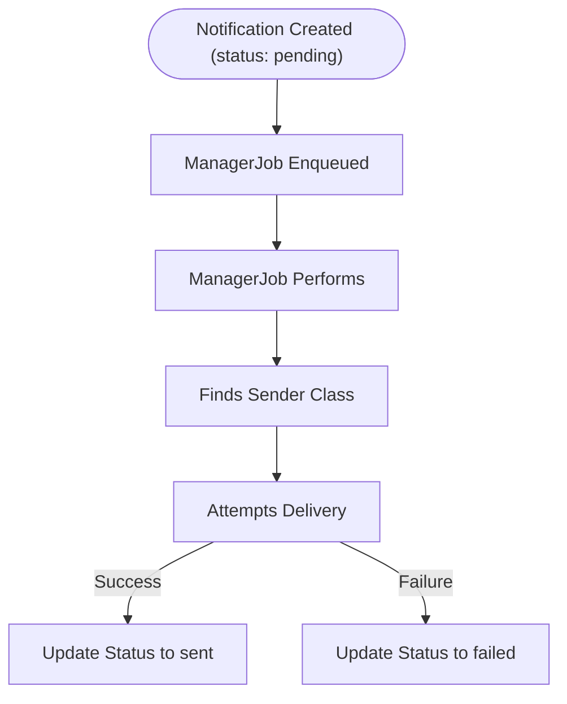
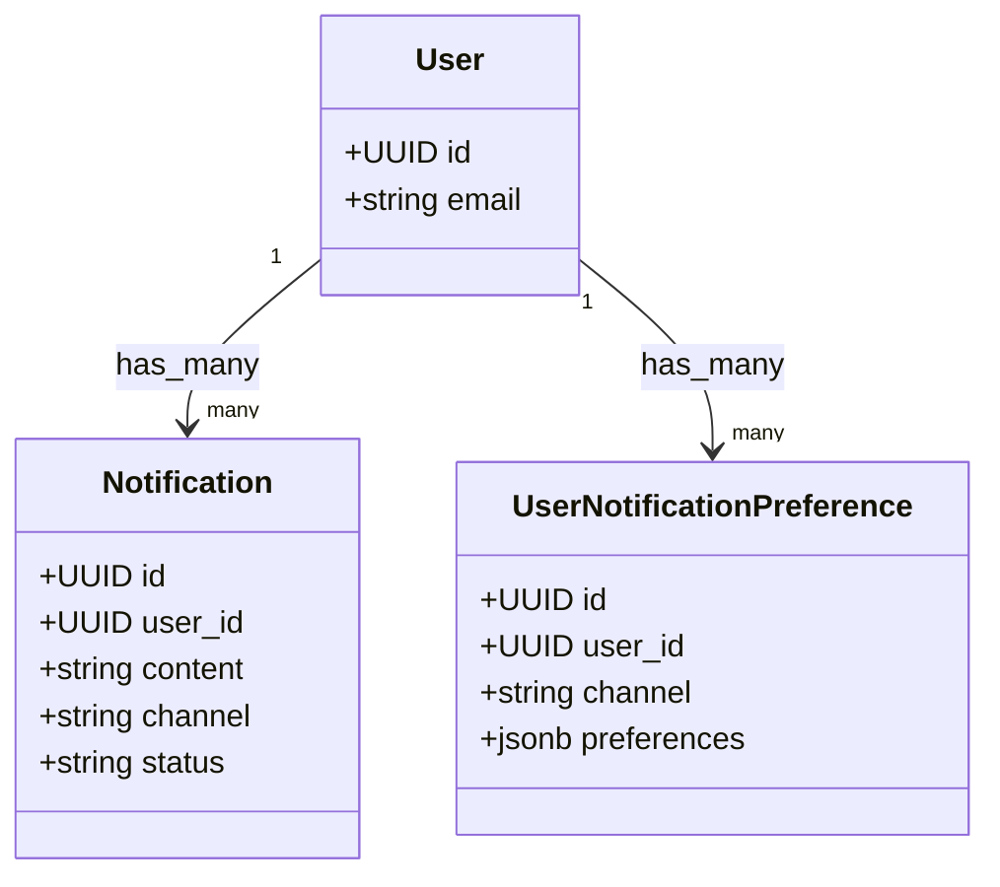

# Notification System

## Overview

This Rails application implements a scalable notification system that supports delivering messages to users via multiple channels (SMS, Email, Push). It is designed for extensibility, respects user preferences, and uses background jobs for asynchronous processing.

---

## Table of Contents

1. [Requirements](#requirements)
2. [Setup](#setup)
3. [API Endpoints](#api-endpoints)
   - [Notifications](#notifications)
   - [User Notification Preferences](#user-notification-preferences)
4. [Notification Lifecycle](#notification-lifecycle)
5. [User Preferences](#user-preferences)
6. [Background Job System](#background-job-system)
7. [Development](#development)
8. [Extending the System](#extending-the-system)
9. [Design Highlights](#design-highlights)
10. [Model Relationships](#model-relationships)
11. [Known Improvements](#known-improvements)

---

## Requirements

- Ruby 3.4.1
- Rails 8.0.2
- PostgreSQL
- Redis (for job scheduling)
- Async Adapter (Rails 7+ default)

---

## Setup

```bash
bundle install
bin/rails db:setup
```

---

## API Endpoints

### Notifications

#### `POST /notifications`

Creates a notification for a single user.

**Payload Example**:
```json
{
  "user_id": "uuid-or-id",
  "content": "Hello World!",
  "channel": "sms",
  "style": "alert"
}
```

#### `POST /notifications/bulk`

Creates notifications for multiple users using the `BulkSendNotification` command.

**Payload Example**:
```json
{
  "user_ids": ["uuid1", "uuid2"],
  "content": "System maintenance notice",
  "channel": "email",
  "style": "reminder"
}
```

#### `GET /notifications/:id`

Returns the status and metadata of a given notification.

---

### User Notification Preferences

Manage a user's per-channel notification preferences.

#### `GET /user/:user_id/notification_preferences`

Returns all preferences for the specified user.

#### `GET /user/:user_id/notification_preferences/:id`

Returns a specific preference.

#### `POST /user/:user_id/notification_preferences`

Creates a new preference.

**Payload Example**:
```json
{
  "user_notification_preference": {
    "channel": "sms",
    "preferences": {
      "enabled": true,
      "style": ["alert", "reminder"],
      "number": "+1234567890"
    }
  }
}
```

#### `PATCH /user/:user_id/notification_preferences/:id`

Updates a specific preference. Accepts the same payload as `POST`.

#### `DELETE /user/:user_id/notification_preferences/:id`

Deletes the specified preference.

---

## Notification Lifecycle

### Diagram



This diagram illustrates the lifecycle of a notification from creation to delivery and final status update.

1. A notification is created with status `pending`.
2. A background job (`Notifications::ManagerJob`) is scheduled.
3. The job finds the `pending` notification and sends it via the appropriate `Sender` class.
4. The notification status is updated to `sent` or `failed`.

---

## User Preferences

User preferences are stored in the `UserNotificationPreference` model and allow for per-channel configuration.

**Example**:
```json
{
  "channel": "sms",
  "preferences": {
    "enabled": true,
    "style": ["alert", "reminder"]
  }
}
```

These preferences are respected during delivery — if a user has disabled a channel or limited styles, the notification is skipped.

---

## Background Job System

- Uses ActiveJob's Async adapter.
- Each notification is processed individually via `Notifications::ManagerJob`.
- Background jobs ensure decoupled, reliable delivery.

---

## Development

### Running Tests

```bash
bundle exec rails test
```

Includes tests for:

- API endpoints (`NotificationsController`, `NotificationPreferencesController`)
- Command logic (`BulkSendNotification`)
- Delivery jobs (`ManagerJob`)
- Preference-based filtering

---

## Extending the System

To add a new channel (e.g., in-app):

1. Create a sender class in `app/lib/notifications/sender/<channel>.rb`.
2. Update `UserNotificationPreference` to accept the new channel.
3. Update `BulkSendNotification::Form` with validation logic.
4. Add handling logic to `Notifications::Manager`.

---

## Design Highlights

- Command pattern via `CommandBase` and `CommandForm`
- Declarative, flexible validation
- Respect for user preferences per channel
- Background job-based architecture
- Easily extendable for new delivery methods
- Use of UUIDs as primary keys to ensure horizontal scalability, enabling easier sharding and avoiding potential ID collisions across distributed systems.

---

## Model Relationships



---

## Known Improvements (WIP)

- Add throttling or deduplication filters
- Batch job execution for bulk messages
- Retry or fallback mechanisms
- API authentication and rate limiting

---

Built for scalability, tested for reliability, and designed for growth.
